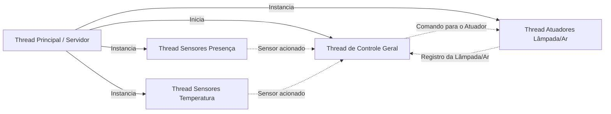
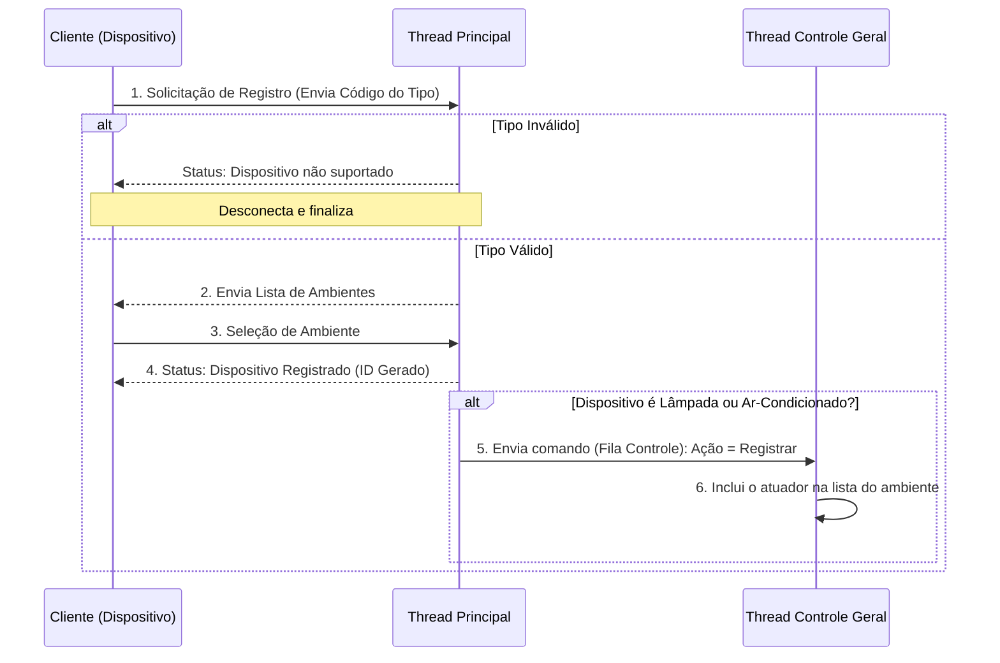
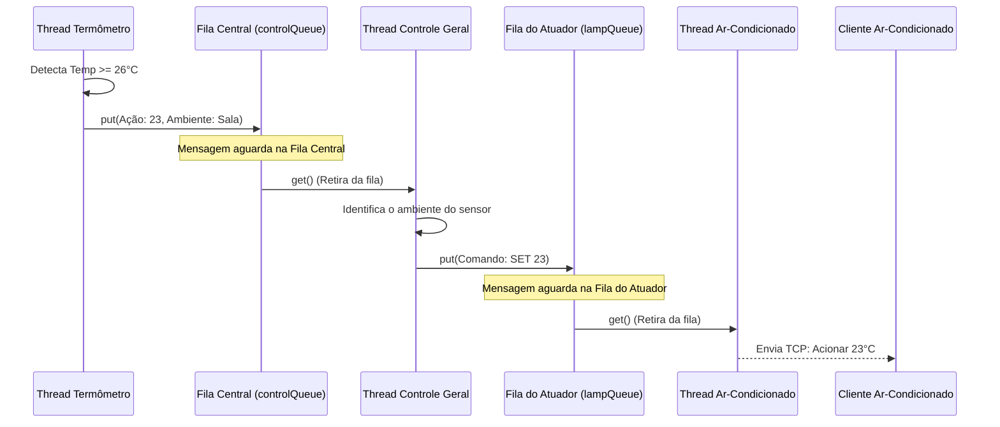

# Mestrado de Computação Aplicada

Repositório acadêmico desenvolvido para a disciplina de **Redes de Computadores** (PPComp / Ifes), focado na documentação, correção de falhas  e expansão de um sistema cliente-servidor baseado em sockets TCP.

## Índice

* [1. Fundamentos de Sockets TCP e Tratamento de Buffer](#1-fundamentos-de-sockets-tcp-e-tratamento-de-buffer)
* [2. Arquitetura e Diagramas de Fluxo](#2-arquitetura-e-diagramas-de-fluxo)
  * [2.1. Visão Geral das Threads](#21-visão-geral-das-threads)
  * [2.2. Fluxo de Inicialização e Registro de Clientes](#22-fluxo-de-inicialização-e-registro-de-clientes)
  * [2.3. Fluxo de Comunicação via Filas (Queues)](#23-fluxo-de-comunicação-via-filas)
* [3. O Protocolo de Comunicação](#3-o-protocolo-de-comunicação)
* [4. Roteiro Detalhado de Testes](#4-roteiro-detalhado-de-testes)
  * [4.1. Inicializando o Servidor](#41-inicializando-o-servidor)
  * [4.2. Registro e Validação de Dispositivos (Cenário de Sucesso)](#42-registro-e-validação-de-dispositivos-cenário-de-sucesso)
  * [4.3. Simulando Mudanças via Teclado (Console)](#43-simulando-mudanças-via-teclado-console)
  * [4.4. Teste de Falha: Dispositivo Não Suportado](#44-teste-de-falha-dispositivo-não-suportado)
* [5. Análise Crítica e Melhorias Implementadas](#5-análise-crítica-e-melhorias-implementadas)

---

## 1. Fundamentos de Sockets TCP e Tratamento de Buffer

O sistema emprega a arquitetura orientada a conexão do protocolo TCP (Transmission Control Protocol) sobre a camada de transporte, utilizando sockets em Python para gerenciar a comunicação entre a central (servidor) e os dispositivos inteligentes da residência.

O Conceito de Sockets TCP no Sistema
Um socket TCP atua como um ponto de comunicação bidirecional desta forma estabelece um canal lógico confiável entre o servidor e cada cliente (Lâmpada, Sensor de Presença, Termômetro ou Ar-Condicionado). Como o TCP opera orientado a fluxos de bytes, ele assegura que todos os pacotes sejam entregues na ordem correta, sem perdas e sem duplicações, gerando um circuito virtual estável para a troca de comandos na infraestrutura desse projeto.

### O Funcionamento do Buffer TCP e o Descompasso entre send() e recv()

O protocolo TCP envia mensagens de forma continua ele só se importa em garantir que a entrega chegue do outro lado sem perdas de dados.
Porém o TCP não distingue frases(exemplo), para ele tudo é enviado em um pacote só.
Ao enviar uma mensagem o TCP envia tudo em um bolo só, por isso que o código do sistema precisa se virar para organizar esse fluxo e saber onde cada mensagem começa e termina.

- Gerenciamento de Buffer pelo SO: Tanto a extremidade transmissora quanto a receptora mantêm buffers de socket gerenciados pelo sistema operacional (buffer de envio e buffer de recepção).
- A Relação 1-para-1 Inexistente: Um único comando executado via send() no código do cliente ou do servidor não resulta necessariamente em uma única chamada correspondente de recv() na outra ponta.
- Fatores Físicos e Lógicos: A fragmentação de rede baseada na MTU (Maximum Transmission Unit) podem fazer com que múltiplos envios sejam concatenados em uma única leitura (recv()), ou que uma única mensagem longa seja fragmentada em pedaços menores recebidos em momentos distintos.

### Como o Código Trata o Buffer

Para resolver esse problema do tratamento do buffer, foi definido estruturas de mensagens com tamanhos e códigos específicos.

Como o TCP pode entregar os pedaços da mensagem quebrados ou grudados, o código do sistema ( Message.py) funciona como um buffer local. Ele vai acumulando tudo o que chega pela rede.

Ele só mexe nos dados e deixa o programa avançar de estado quando tem certeza de que a mensagem veio inteira e completa. Isso impede que o sistema tente ler um pedaço cortado pela metade, garantindo que a comunicação (DeviceThread) entre o servidor e os aparelhos funcione sem bugs .

---

## 2. Arquitetura e Diagramas de Fluxo

O sistema adota uma arquitetura **Cliente/Servidor Multithread**, onde a central de controle gerencia conexões TCP simultâneas e o estado de múltiplos ambientes residenciais de forma concorrente. 

Abaixo detalhamos o papel de cada thread e como ocorre a troca de mensagens utilizando filas (queues).

### 2.1. Visão Geral das Threads
O servidor central gerencia diferentes tipos de threads para não bloquear a execução enquanto atende múltiplos clientes.

- Thread Principal (Server.py): Fica em um loop contínuo ouvindo a porta TCP. Ao identificar uma nova conexão, valida o tipo do dispositivo e inicia uma nova thread dedicada (Thread de Dispositivo) para ele.

- Threads de Dispositivos (DeviceThread.py): Cuidam exclusivamente de um cliente. Sensores (Temperatura/Presença) enviam dados para o servidor. Atuadores (Lâmpadas/Ar-Condicionado) ficam aguardando comandos.

- Thread de Controle Geral (GeneralControl.py): É o cérebro do sistema. Ela interliga os sensores aos atuadores do mesmo ambiente.

### 2.2. Fluxo de Inicialização e Registro de Clientes
O diagrama abaixo demonstra o fluxo exato de quando um cliente se conecta, como ele é validado e como os atuadores (como o novo Ar-Condicionado) são registrados na Fila de Controle.

2.3. Fluxo de Comunicação via Filas 
O desacoplamento entre os sensores (que geram eventos) e os atuadores (que executam as ordens) é feito por meio de estruturas de filas thread-safe (queue.Queue), garantindo que não ocorram colisões de dados.

O diagrama abaixo ilustra a extensão do sistema, onde o termômetro aciona o ar-condicionado utilizando filas:

* Dinâmica das Filas: Como o Termômetro e o Ar-Condicionado rodam em threads separadas, eles não "conversam" diretamente. O Termômetro coloca a informação na Fila Central. A Thread de Controle retira essa informação, procura quais atuadores estão no mesmo ambiente e coloca o comando na Fila Privativa do Atuador.

---

## 3. O Protocolo de Comunicação

O sistema utiliza um protocolo de aplicação customizado sobre o TCP. Para evitar problemas de fragmentação de pacotes na rede, o protocolo estabelece um formato fixo para as mensagens, garantindo que o servidor e os clientes saibam exatamente como extrair as informações do buffer TCP.

### Formato Fixo das Mensagens (Estrutura de Bytes)
Todas as mensagens trocadas seguem uma estrutura binária empacotada, onde a ordem dos campos e seus tamanhos são organizados em múltiplos de 1 byte. O cabeçalho padrão de todas as mensagens obedece à seguinte ordem obrigatória:

1. **Código da Mensagem (1 byte):** Inteiro que identifica o tipo de operação (ex: 2 para Registro, 6 para Acionamento)[cite: 22].
2. **Data e Hora da Mensagem (Timestamp):** Carimbo temporal gerado no momento do empacotamento, utilizado para logs e ordenação de eventos históricos[cite: 22].
3. **ID do Dispositivo (Inteiro):** Identificador único, numérico e sequencial. É preenchido com `0` antes do registro e assume o valor definitivo após a atribuição pelo servidor[cite: 22].
4. **Carga Útil (*Payload* - Variável):** O restante dos bytes carrega a informação específica daquela mensagem (ex: o valor lido por um sensor ou o comando para uma lâmpada).

---

### Ordem de Envio e Exemplos Práticos de Comunicação

A comunicação obedece a um sequenciamento de requisição e resposta. Abaixo detalhamos as duas fases principais do ciclo de vida de um dispositivo e o que exatamente o código envia pela rede:

#### Fase 1: Handshake e Registro do Dispositivo
Sempre que um novo cliente se conecta (ex: Ar-Condicionado), a seguinte sequência de mensagens ocorre obrigatoriamente:
1. **Cliente `->` Servidor:** Envia `MSG_REGISTRO` (Código `2`) + O caractere do seu tipo (ex: `'A'` para Ar-Condicionado).
2. **Servidor `->` Cliente:** Valida o tipo e responde com `MSG_LISTA_AMBIENTES` (Código `3`) + O dicionário de cômodos lido do arquivo `ambientes.txt`.
3. **Cliente `->` Servidor:** O usuário digita o ambiente no console, e o cliente envia `MSG_SELECIONA_AMBIENTE` (Código `4`) + ID do ambiente (ex: `1` para Sala).
4. **Servidor `->` Cliente:** Cadastra o dispositivo na memória, gera seu ID único (ex: ID `3`) e responde com `MSG_STATUS` (Código `1`) informando `DISPOSITIVO_REGISTRADO`.

#### Fase 2: Operação Contínua (Exemplos de Ações)

* **Exemplo A: Acendendo uma Lâmpada (Comando do Servidor)**
  * **Servidor envia:** `MSG_LAMPADA` (Código `6`) contendo a **Ação `1`** (Ligar).
  * **Cliente Lâmpada recebe:** Processa a ação, imprime na tela `LAMPADA LIGADA` e retorna a confirmação.
  * **Cliente responde:** `MSG_STATUS` (Código `1`) contendo o status **`3`** (`ACAO_EXECUTADA`).

* **Exemplo B: Climatização do Ar-Condicionado (Comando do Servidor)**
  * **Servidor envia:** `MSG_LAMPADA` (Código `6`) contendo a **Ação `23`**.
  * **Cliente Ar-Condicionado recebe:** Ajusta a temperatura na tela para `SET 23°C` e retorna a confirmação.
  * **Cliente responde:** `MSG_STATUS` (Código `1`) contendo o status **`3`** (`ACAO_EXECUTADA`).

* **Exemplo C: Envio de Leitura de Temperatura (Comando do Cliente)**
  * **Cliente Termômetro envia:** `MSG_SENSOR` (Código `5`) contendo o valor numérico lido **`26.0`**.
  * **Servidor recebe:** Processa a automação térmica na fila e devolve o recibo.
  * **Servidor responde:** `MSG_STATUS` (Código `1`) contendo o status **`2`** (`LEITURA_RECEBIDA`).
---
## 4. Roteiro Detalhado de Testes

Para validar a arquitetura Cliente/Servidor, a troca de mensagens TCP e as regras de negócio de automação residencial, siga o roteiro de testes abaixo. É necessário abrir múltiplos terminais simultaneamente.

### 4.1. Inicializando o Servidor
O servidor atua como a central inteligente da casa e deve ser o primeiro a ser iniciado[cite: 22]. 

1. Abra um terminal na pasta raiz do projeto.
2. Execute o comando de inicialização: `python Server.py`
3. **Observação de Logs:** O terminal do servidor exibirá a mensagem informando que a Thread de Controle Geral foi iniciada e que o sistema está aguardando conexões na porta 5000.

> 📸 **[COLOQUE AQUI O PRINTSCREEN DO SERVIDOR INICIADO E AGUARDANDO CONEXÕES]**

---

### 4.2. Registro e Validação de Dispositivos (Cenário de Sucesso)
Ao conectar, o dispositivo informa seu tipo, o servidor valida, solicita o ambiente e gera um ID para a comunicação[cite: 22]. Faremos o teste com o novo dispositivo de Ar-Condicionado.

1. Em um **segundo terminal**, execute o cliente do Ar-Condicionado: `python Cliente_ArCondicionado.py`
2. **Processo de Registro:**
   * O cliente envia seu código de tipo ao servidor.
   * O servidor valida o tipo e envia de volta a lista de ambientes disponível no arquivo `ambientes.txt`[cite: 22].
   * No terminal do cliente, aparecerá a solicitação: `ID do ambiente: `.
3. Digite `1` (referente à Sala) e pressione Enter.
4. **Observação de Logs (Servidor):** Verifique no terminal do servidor a impressão dos logs obrigatórios confirmando o registro:
   * `Dispositivo do tipo Ar-Condicionado (A) registrado`
   * `Ambiente selecionado = [1] Sala`

> 📸 **[COLOQUE AQUI O PRINTSCREEN MOSTRANDO O CLIENTE SELECIONANDO A SALA E O LOG DO SERVIDOR CONFIRMANDO]**

---

### 4.3. Simulando Mudanças via Teclado (Console)
Os sensores simulam a interação do mundo físico capturando dados do teclado e enviando pacotes TCP contínuos ao servidor[cite: 22].

#### A) Sensor de Presença (Valores 0 e 1)
1. Em um **terceiro terminal**, inicie o Sensor de Presença e registre-o no ambiente `1` (Sala)[cite: 14]: `python Cliente_Presenca.py`
2. O terminal exibirá o menu de simulação:
   * `0) para indicar que o sensor não detectou ninguém`[cite: 14]
   * `1) para indicar uma presença detectada`[cite: 14]
3. Digite `1` e pressione Enter.
4. **Observação de Logs:** 
   * **No Cliente:** O terminal informará o envio da mensagem e aguardará a confirmação. Em seguida, exibirá `Leitura recebida pelo servidor!!!`[cite: 14].
   * **No Servidor:** O terminal imprimirá a recepção do dado `VALOR LIDO DO SENSOR = 1`, repassando o comando pela fila para acender a Lâmpada[cite: 20].

#### B) Sensor de Temperatura (Regra de Climatização)
1. Em um **quarto terminal**, inicie o Termômetro e registre-o na Sala (ID `1`)[cite: 15]: `python Cliente_Temperatura.py`
2. O terminal solicitará: `Temperatura lida no sensor: `[cite: 15]. Digite `26.0` e pressione Enter.
3. **Observação de Logs da Automação (Servidor e Ar-Condicionado):**
   * O servidor registrará o recebimento e ativará a regra lógica: `Temperatura >= 26. Reduzindo Ar-Condicionado para 23.`[cite: 20]
   * Repare no terminal do **Ar-Condicionado** (aberto no passo 4.2). Ele receberá a mensagem instantaneamente do servidor e exibirá na tela o acionamento: `AR-CONDICIONADO: SET 23°C`.

> 📸 **[COLOQUE AQUI O PRINTSCREEN DO CONSOLE DO SENSOR DE TEMPERATURA (ENVIANDO 26.0) E DO AR-CONDICIONADO (RECEBENDO SET 23°C)]**

---

### 4.4. Teste de Falha: Dispositivo Não Suportado
O servidor possui um mecanismo de defesa caso um dispositivo tente se conectar com um código não cadastrado no arquivo `dispositivos.txt`[cite: 21, 22]. 

* **Como simular:** Altere temporariamente o código fonte de um cliente (ex: `Cliente_Lampada.py`) mudando a constante de inicialização para um número inexistente, como `99` (ex: `device = Device(connection, 99)`).
* **Comportamento Esperado:**
  1. Ao iniciar este cliente adulterado, ele envia a solicitação de registro.
  2. O servidor consulta o dicionário de tipos (`GetTypeItem`) e não encontra a chave `99`.
  3. O servidor responde com o código de erro `ERRO_DISPOSITIVO_NAO_SUPORTADO` (código 5)[cite: 20].
  4. **Observação de Logs (Servidor):** O servidor imprime no terminal: `Dispositivo não suportado código=(99)` e encerra a conexão do socket imediatamente de forma segura, retornando ao estado de Desconectar (`SM_DESCONECTAR`)[cite: 20, 22].

> 📸 **[COLOQUE AQUI O PRINTSCREEN DO LOG DO SERVIDOR REJEITANDO A CONEXÃO COM A MENSAGEM DE 'DISPOSITIVO NÃO SUPORTADO']**

---
## 5. Análise Crítica e Melhorias Implementadas

Durante a apropriação e extensão deste sistema legado de *Smart Home*, foi possível identificar oportunidades de correção e melhorias arquiteturais, bem como apontar limitações que podem ser abordadas em versões futuras.

### 5.1. Correções Realizadas no Código Original (Bugs Fixes)
* **Correção de Chamada de Função (`NameError`):** No arquivo original `DeviceThread.py`, o tratamento de erros (como em cenários de ID de dispositivo inválido ou ambiente incorreto) tentava chamar a função `sendMessage()` com a letra "s" minúscula[cite: 9]. Isso gerava uma exceção que travava a thread do servidor e desconectava o cliente abruptamente. O código foi corrigido para a chamada correta `SendMessage()`.
* **Tratamento do Valor Inicial do Atuador:** O estado inicial dos dispositivos (`device.value`) foi reajustado. Na versão original, um atuador inicializado com valor `0` poderia ignorar um primeiro comando de desligamento (valor `0`) oriundo da fila devido a uma checagem de diferença de estado.

### 5.2. Melhorias na Extensão do Sistema (Ar-Condicionado)
* **Escalabilidade via Reaproveitamento de Filas:** Para integrar o Ar-Condicionado inteligente sem quebrar ou precisar reescrever a complexa Thread de Controle Geral (`GeneralControl.py`), o novo dispositivo utilizou a infraestrutura de filas dos atuadores originais. O Ar-Condicionado entra no dicionário de filas sendo roteado de forma transparente, provando a robustez da arquitetura orientada a mensagens assíncronas (`queue.Queue`).
* **Automação Desacoplada:** A regra de negócio ($\ge 26^\circ\text{C}$ dispara $23^\circ\text{C}$) não bloqueia a comunicação da rede. A lógica foi embutida no recebimento da leitura do termômetro, injetando o comando na Fila Central para que a *Thread* de Controle Geral faça o roteamento até o atuador correspondente no mesmo cômodo.

### 5.3. Análise Crítica e Trabalhos Futuros (Limitações)
Embora funcional, o sistema apresenta pontos de melhoria importantes considerando o contexto de IoT (*Internet of Things*):
1. **Regras de Automação Estáticas (*Hardcoded*):** A condição térmica para ativar o ar-condicionado está escrita diretamente no código da thread. Um aprimoramento ideal seria criar um motor de regras lendo um arquivo de configuração (ex: JSON ou XML), permitindo que o usuário altere gatilhos sem precisar recompilar ou reiniciar o servidor.
2. **Segurança de Rede:** A comunicação ocorre via *sockets* TCP sem criptografia (texto claro empacotado em bytes). Em um ambiente de rede real, um atacante na mesma rede Wi-Fi poderia facilmente interceptar os pacotes ou injetar comandos falsos. A implementação de **TLS/SSL** seria necessária para segurança.
3. **Persistência de Dados e Histórico:** Conforme sugerido nos comentários internos do próprio código base original, as leituras dos sensores são atualmente voláteis[cite: 9]. Integrar um banco de dados leve (como SQLite) para persistir o histórico de acionamentos e leituras é um passo essencial para transformar este protótipo em uma solução comercial.
