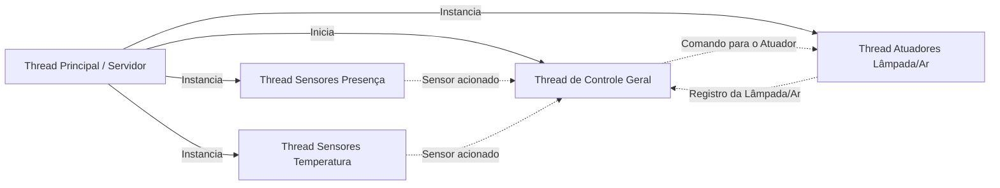
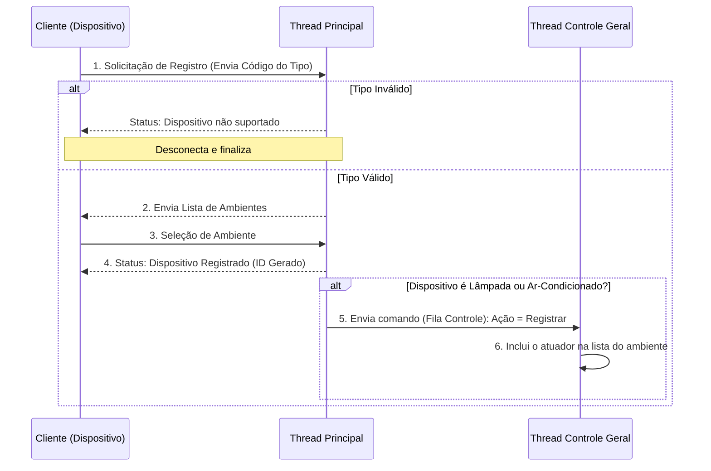
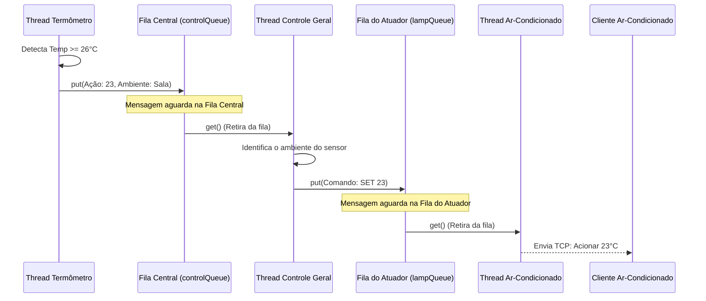

# Mestrado de Computação Aplicada

Repositório acadêmico desenvolvido para a disciplina de **Redes de Computadores** (PPComp / Ifes), focado na documentação, correção de falhas  e expansão de um sistema cliente-servidor baseado em sockets TCP.

---

## 1. Fundamentos de Sockets TCP e Tratamento de Buffer

O sistema emprega a arquitetura orientada a conexão do protocolo TCP (Transmission Control Protocol) sobre a camada de transporte, utilizando sockets em Python para gerenciar a comunicação entre a central (servidor) e os dispositivos inteligentes da residência.

O Conceito de Sockets TCP no Sistema
Um socket TCP atua como um ponto de comunicação bidirecional desta forma estabelece um canal lógico confiável entre o servidor e cada cliente (Lâmpada, Sensor de Presença, Termômetro ou Ar-Condicionado). Como o TCP opera orientado a fluxos de bytes, ele assegura que todos os pacotes sejam entregues na ordem correta, sem perdas e sem duplicações, gerando um circuito virtual estável para a troca de comandos na infraestrutura desse projeto.

### O Funcionamento do Buffer TCP e o Descompasso entre send() e recv()

O protocolo TCP envia mensagens de forma continua ele só se importa em garantir que a entrega chegue do outro lado sem perdas de dados.
Porém o TCP não distingue frases(exemplo), para ele tudo é enviado em um pacote só.
Ao enviar uma mensagem o TCP envia tudo em um bolo só, por isso que o código do sistema precisa se virar para organizar esse fluxo e saber onde cada mensagem começa e termina.

- Gerenciamento de Buffer pelo SO: Tanto a extremidade transmissora quanto a receptora mantêm buffers de socket gerenciados pelo sistema operacional (buffer de envio e buffer de recepção).
- A Relação 1-para-1 Inexistente: Um único comando executado via send() no código do cliente ou do servidor não resulta necessariamente em uma única chamada correspondente de recv() na outra ponta.
- Fatores Físicos e Lógicos: A fragmentação de rede baseada na MTU (Maximum Transmission Unit) podem fazer com que múltiplos envios sejam concatenados em uma única leitura (recv()), ou que uma única mensagem longa seja fragmentada em pedaços menores recebidos em momentos distintos.

### Como o Código Trata o Buffer

Para resolver esse problema do tratamento do buffer, foi definido estruturas de mensagens com tamanhos e códigos específicos.

Como o TCP pode entregar os pedaços da mensagem quebrados ou grudados, o código do sistema ( Message.py) funciona como um buffer local. Ele vai acumulando tudo o que chega pela rede.

Ele só mexe nos dados e deixa o programa avançar de estado quando tem certeza de que a mensagem veio inteira e completa. Isso impede que o sistema tente ler um pedaço cortado pela metade, garantindo que a comunicação (DeviceThread) entre o servidor e os aparelhos funcione sem bugs .


---

## 2. Arquitetura e Diagramas de Fluxo

O sistema adota uma arquitetura **Cliente/Servidor Multithread**, onde a central de controle gerencia conexões TCP simultâneas e o estado de múltiplos ambientes residenciais de forma concorrente. 

Abaixo detalhamos o papel de cada thread e como ocorre a troca de mensagens utilizando filas (queues).

### 2.1. Visão Geral das Threads
O servidor central gerencia diferentes tipos de threads para não bloquear a execução enquanto atende múltiplos clientes.



- Thread Principal (Server.py): Fica em um loop contínuo ouvindo a porta TCP. Ao identificar uma nova conexão, valida o tipo do dispositivo e inicia uma nova thread dedicada (Thread de Dispositivo) para ele.

- Threads de Dispositivos (DeviceThread.py): Cuidam exclusivamente de um cliente. Sensores (Temperatura/Presença) enviam dados para o servidor. Atuadores (Lâmpadas/Ar-Condicionado) ficam aguardando comandos.

- Thread de Controle Geral (GeneralControl.py): É o cérebro do sistema. Ela interliga os sensores aos atuadores do mesmo ambiente.

### 2.2. Fluxo de Inicialização e Registro de Clientes
O diagrama abaixo demonstra o fluxo exato de quando um cliente se conecta, como ele é validado e como os atuadores (como o novo Ar-Condicionado) são registrados na Fila de Controle.



2.3. Fluxo de Comunicação via Filas (Queues)
O desacoplamento entre os sensores (que geram eventos) e os atuadores (que executam as ordens) é feito por meio de estruturas de filas thread-safe (queue.Queue), garantindo que não ocorram colisões de dados.

O diagrama abaixo ilustra a extensão do sistema, onde o termômetro aciona o ar-condicionado utilizando filas:



* Dinâmica das Filas: Como o Termômetro e o Ar-Condicionado rodam em threads separadas, eles não "conversam" diretamente. O Termômetro coloca a informação na Fila Central. A Thread de Controle retira essa informação, procura quais atuadores estão no mesmo ambiente e coloca o comando na Fila Privativa do Atuador.

---

## 3. O Protocolo de Comunicação

O protocolo de aplicação define a estrutura binária e o sequenciamento das mensagens trocadas entre clientes e servidor[cite: 32]. Cada mensagem possui campos com tamanhos múltiplos de 1 byte[cite: 32]:
* **Código da Mensagem (1 byte):** Identifica a operação (ex: Registro, Listagem, Seleção, Envio de Sensor, Acionamento).
* **Data e Hora:** Carimbo temporal para registro de logs e histórico.
* **ID do Dispositivo:** Identificador único atribuído pelo servidor após o registro no ambiente.

### Tabela de Códigos de Mensagens
| Código | Tipo / Função | Descrição |
| :--- | :--- | :--- |
| `2` | `MSG_REGISTRO` | Enviado pelo cliente informando seu tipo ao conectar. |
| `3` | `MSG_LISTA_AMBIENTES` | Servidor envia o dicionário de cômodos disponíveis. |
| `4` | `MSG_SELECIONA_AMBIENTE` | Cliente informa o ID do cômodo onde está instalado. |
| `5` | `MSG_SENSOR` | Envio de leituras contínuas (temperatura ou presença). |
| `6` | `MSG_LAMPADA` / Atuador | Comando de acionamento enviado pelo servidor ao atuador. |

---

## 4. Roteiro Detalhado de Testes

### Inicialização do Servidor
1. Abra o terminal na raiz do projeto e execute:
```
   python Server.py
```
O terminal exibirá a mensagem de inicialização da Thread de Controle Geral e o socket aguardando conexões na porta 5000. 

2. Testando a Extensão (Ar-Condicionado) 

- Conexão do Atuador: Em um novo terminal, inicie o cliente do novo dispositivo:
```
 Cliente_ArCondicionado.py
```

* O cliente se conecta, envia o tipo 4 (Ar-Condicionado), recebe a lista de cômodos do ambientes.txt e solicita a seleção.
  Digite 1 (Sala).


- Conexão do Sensor de Temperatura: Em outro terminal, inicie o termômetro:
  
```
Cliente_Temperatura.py
``` 

  Selecione o ambiente 1 (Sala).

Disparando a Regra de Automação:No terminal do termômetro, digite uma temperatura $\ge 26.0$ (ex: 26.0).  
Resultado esperado: O servidor processa a leitura, identifica o gatilho da regra e envia o comando de setpoint 23. 
O terminal do Ar-Condicionado exibirá imediatamente:
```
AR-CONDICIONADO: SET 23°C
```

Tratamento de Erros (Dispositivo Não Suportado)
Se um cliente desconhecido tentar se conectar enviando um código de tipo inválido não mapeado no dispositivos.txt, o servidor intercepta a falha na função WorkStart, registra o erro ERRO_DISPOSITIVO_NO_SUPORTADO (código 5), exibe o log de rejeição no terminal e encerra a conexão do socket com segurança.

5. Análise Crítica e Melhorias Implementadas
Correção de Bugs Legados: Correção de exceções do tipo NameError em funções de envio e padronização do tratamento de f-strings.

Desacoplamento de Atuadores: Ampliação da máquina de estados para suportar múltiplos atuadores além da lâmpada tradicional, permitindo a integração fluida do Ar-Condicionado sem quebrar o protocolo base.
